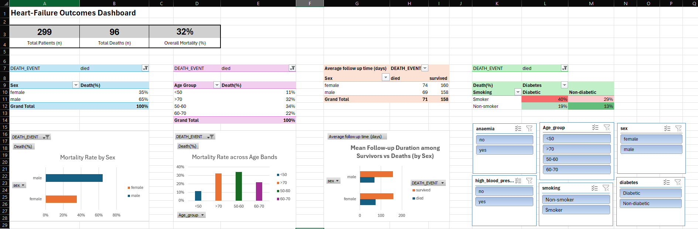

# heart_failure_dashboard
Excel pivot‑table dashboard analysing mortality factors in heart‑failure patients.

# Key insights
* Overall mortality: 32 % (96/299)
* Male deaths account for 65 % of total
* Smokers with diabetes: 40 % mortality vs 13 % baseline

# How to use
1. Open **heart_failure_clinical_records_project.xlsx** in desktop Excel ≥ 2016.  
2. Use the slicers to filter by Death event, Age band, Smoking etc.  
3. KPI tiles and charts update automatically.
